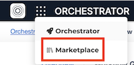

# Usecase 2 - Templates and NoCode

## Overview - What's in the section?
Time: ~30 minutes

In this section, we will begin to make use of the StackGuardian marketplace, which can be seen as a library for templates and blueprints. But it is more than that - it also allows you to manage the versions and lifecycle of your IaC templates, across different protocols, combine multiple templates into a stack and use NoCode to deploy them. 
The goal of this usecase is to show:

* Standardize on blueprints and templates
* Collaborate between teams in an organisation
* NoCode Interface to simplify Deployment of infrastructure
* Versioning and Lifecycle of templates

_Fig. Use the marketplace to manage and deploy templates_

## 2.1 - Create template in marketplace
### Description
In 2.1. we will see how to create a new template in the private marketplace, which is only visible in your own organisation. FYI, we will not deploy this template for a AWS VPC because it will need to many parameters to be set. 
In 2.2 we will leverage the public marketplace to find a template that is pointing to the same repo but with a nice NoCode interface.

### Create template in marketplace
On the left top click on the 9 dots next to Orchestrator and then on **Marketplace**
  
  
_Fig. Marketplace Link_  
  
Once on the marketplace you can check out the different links or jsut continue to **Create Template +** which you can find on the right side of the screen.

 
_Fig. Create template on marketplace_  

1. Template Name = ``vpc-xx``
2. Source Config Kind = **TERRAFORM**
3. Source Destination Kind = **github.com**
4. Repository URL = ``https://github.com/StackGuardian/terraform-aws-vpc``
5. Click **Generate No Code Form**
6. Scroll all the way down and **Create**

Explore first alone and then together with the instructor the different tabs Usage, Analysis, Code and Meta. 
The **NoCode** tab will be used to adjust the generated NoCode interface for the specific needs. 

## 2.2 - Deploy an AWS VPC from existing template
### Description
In this exercise we will deploy a VPC from the marketplace.  

### Deploy from template
In the marketplace overview select **workshop Templates** and **Infrastructure as Code**. This is the private marketplace for the workshop organisation and only visible to the members of workshop. 
In the top search bar type ``vpc``. This should show you the **terraform-aws-vpc-stripped** IaC template. Go ahead and check out what is inside.

 
_Fig. VPC template in marketplace_  

Check the Meta>Repo entry. It refers to the same repository, which we used in 2.1 to create the VPC template. Still, when you check the **NoCode** tab you see a huge difference - less paramters and also predefind values. Have a look at the **Show Schema** to understand what was changed in the JSON & UI Schema to achieve this. 

To deploy the VPC open the latest Revision on the left side and click **Create Workflow**.

 
_Fig. Create VPC from latest revision_  

To create the workflow fill in following values - remember to substitute the **xx** with your number: 

1. Select Workflow Group = **wfg-xx**
2. Click **Next**

3. Workflow Name = **marketplace-vpc-xx**
4. Click **Next**

5. Choose Integrations = **AWS-Deploy-Role**
6. Click **Next**

7. VPC Name = **workshop-vpc-xx**
8. CIDR Block for VPC = _choose one_
9. Public Subnets IP Addresses = _choose one_
10. Private Subnets IP Addresses = _choose one_
11. Click **Save & Run**

In the **Runs** tab you can follow the deployment. Once the VPC is ready, the Status will change to **Completed**. 
This concludes the 2nd usecase.