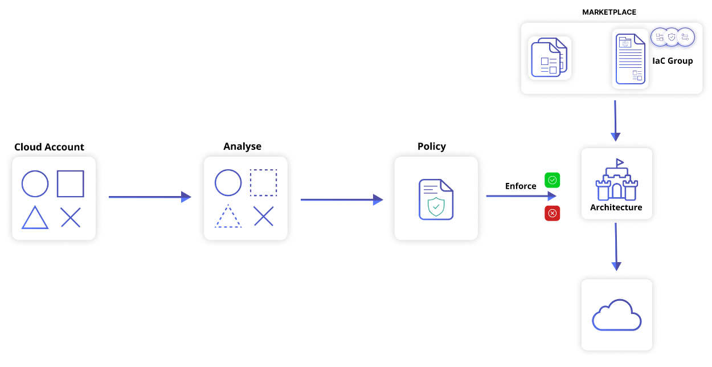
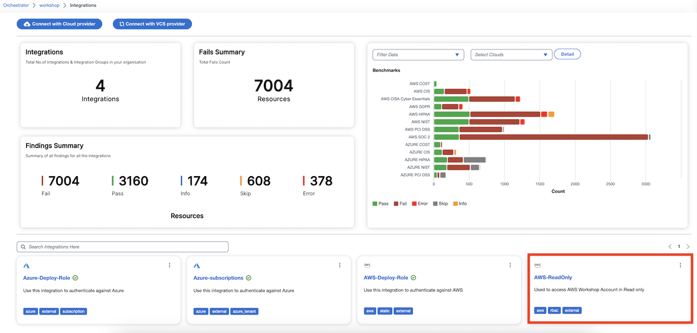

# Usecase 4 - Provide and Enforce Guardrails

## Overview - What's in the section?
Time: ~30 minutes  

The focus of this exercise is on policies and guardrails. StackGuardian developed its own Open Source Policy Engine called Tirith. With Tirith you can enforce on resources and attributes like instance types, storage size or necessary tags but also on infrastructure cost and the workflow process. 
The aim of this part is to demonstrate the following:

* Identify Shortcomings in current deployments
* Create and enforce proactive guardrails at deployment
* Approval process and exception handling 
* Drift detection and continuous compliance


_Fig. Create and enforce proactive policies_

## 4.1 - Identify current shortcomings
### Description
Indepent of the way the infrastructure in the Cloud Accounts is created, StackGuardian is analysing it in regards to Cost, Security, Compliance & Best Practises. 

### Integrations page
In the **Orchestrator** go to the **Integrations** tab and choose the **AWS-ReadOnly** account. 


_Fig. Integrations page in Orchestrator_


On the left side you can find the different Best Practice checks like Cost, CIS and PCI DSS. While on the right side you can go into more details to find out about specific **Fails** and how to mitigate them in the future with a proper **Build Tirith Policy**. Explore the integrations page for yourself and with the instructors. 

## 4.2 - Tirith policies to pass or fail 
### Description
Thirith policies can be used for different purposes. In this section we will see, what happens when policies pass or fail.

### Pass or Fail 
Navigate in the **orchestrator** to **Policies**. Open **define-necessary-tags-eks-node** and change to the **Rules** tab. The first part shows, what will happen if a deployment is within the guardrails and passes but also what should happen when the guardrails are not met. 
When a new policy is introduced, it might be advisable to just **Warn** the user to follow it. After some weeks it might be necessary to drive correct behaviour and enable the **Approval Process**. This keeps the workflow from deploying until the approving person(s) cleared or declined the request. For security or regulatory policies it could be necessary to set a strict **Fail**, in this case the workflow is stopped before deploying resources to the cloud accounts. 

  
_Fig. Passing or Failing the policy_  

## 4.3 - Tirith policies to guardrail IaC attributes
### Description
We look at a policy for terraform resources and attributes itself and see how it is structured.

### Guardrail IaC attributes
When scrolling down in the **define-necessary-tags-eks-node** policy to the section called **Tirith Policy**, we find the Select Provider set to **Terraform Plan**. This shows us, that the policy will operate on resources and attributes of the terraform plan. 
While the Operation Type is set to **Check for terraform resource attribute**, the policy will evaluate from the Cloud Provider AWS the resource **aws_eks_node_group**. When you click on the attribute box you will see all the possible attributes that the specfic resource could have and can build a policy around it. 
In our case we look at the attribute **tags** and check if it contains the key:value pair **costcenter:workshop**. 

Explore the policy settings further.

  
_Fig. Tirith Policy for Tags_  

## 4.4 - Tirith policy on Cost
### Description
In this paragraph we will look into a cost policy. Currently we are evaluating the static cost for resources but we are working on dynamic cost calculation. 
### Cost policies
In the orchestrator on the policy page choose **define-allowed-eks-node-cost**. When clicking on **Rules** and scrolling down to **Tirith Policy** you will see that this time a different Provider is selected: **Infracost**. 
In the dropdown for Operation Type you can choose to  ........

  
_Fig. Tirith Policy for Cost_ 

## Lab 4.3 - AppIQ
### Description
**AppIQ** is every cloud operator’s best friend and will always help to find that needle in a haystack.  When a connectivity issue arises between VPCs, regions, clouds, there are many places in the cloud infrastructures that need to be checked.  AppIQ query the cloud providers and show whether Routing at the VPC, Subnet, Gateways, NACLs, and Security Groups are configured correctly at Source and Destination to properly allow the communication.
### Validate
Open CoPilot and navigate to **_AppIQ_**.
* In the **Source Instance** dropdown, select the instance _gcp-srv1_
* In the **Destination Instance** dropdown, select the instance _shared-srv_
* Enter port _443_, select the _Private interface_ and click **Submit**

  
_Fig. AppIQ_  

### Expected Results
AppIQ will show you the path between the selected VMs, will show the latency on each hop, Gateway utilization on each hop and all infrastructure related settings (security groups, route tables, etc).  Scroll through the results - sometimes a simple thing like a missing security group rule can take hours to troubleshoot, but with AppIQ you can get find the issues in seconds or minutes.  

  
_Fig. AppIQ Results_  

## Lab 4.4 - Troubleshooting Site2Cloud and BGP
### Description
The Aviatrix Controller allows you to conveniently view tunnel logs for Site2Cloud connections as well as run BGP commands to get insights into BGP session states, neighbor status, etc.
### Validate
To view the status of a Site2Cloud connection, navigate to **_Site2Cloud -> Diagnostics_**.  Select the _VPC_, _Aviatrix GW_ and **Show Logs**.

  
_Fig. Site2Cloud Status_  

This is helpful in situations where there is a configuration or negotiation issue in either Phase 1 or Phase 2 negotiation.  

Once Site2Cloud connection is up, you can verify the BGP session status **_Multi-Cloud Transit -> Advanced Config -> BGP_**.  Here you will see the state of a selected BGP connection and whether it has learned any routes.  

  
_Fig. BGP Status_  

To run some commands from the GW, click the **_BGP Diagnostics_** tab and select the Aviatrix Transit GW from the list.  Select a command from the list, or type:  ```show ip bgp neighbors```

  
_Fig. BGP Commands_  

### Expected Results
Use the above commands to troubleshoot IPSEC tunnels and BGP connections.

## Lab 4.5 - FlowIQ
### Description
All of the Aviatrix Gateways are configured to stream rich netflow data to CoPilot.  This means that each flow and it's details that goes across your cloud network is visible in CoPilot.  CoPilot offers powerful searching using simple or complex filters, shows top talkers and much more.
### Validate
Login to CoPilot and navigate to **_FlowIQ_**.  In the **Overview** tab, let's create a filter to show all ICMP traffic across the network in the past 24 hours.  

* Click the button **_Last Day_** and then **_Add Rule_** under **_Edit Filters_**
* In the _Select Field_ dropdown, select _Protocol Name_, _is equal to_, and enter **ICMP** in that field
* Click **Apply Changes**

### Expected Results
Find any flow that goes across your cloud network.  In this example we are looking at all pings across the cloud network over the last 24 hours, but you can create much more complex filters.

  
_Fig. FlowIQ_ 