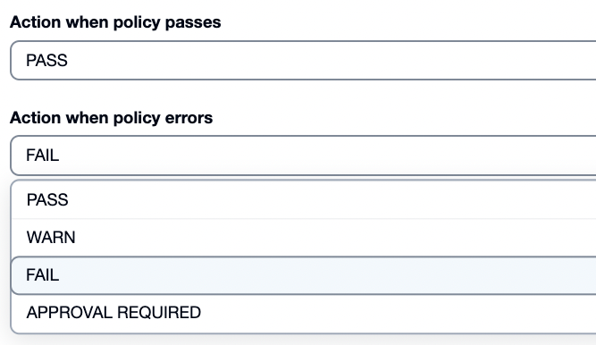
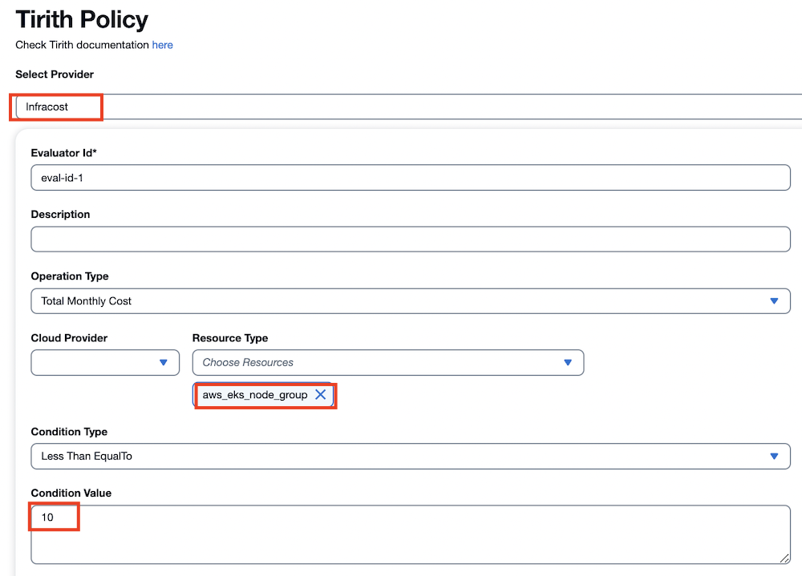
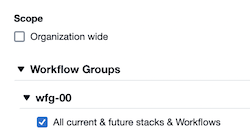

# Usecase 4 - Create and Enforce Guardrails

## Overview - What's in the section?
Time: ~30 minutes  

The focus of this exercise is on policies and guardrails. StackGuardian developed its own Open Source Policy Engine called Tirith. With Tirith you can enforce on resources and attributes like instance types, storage size or necessary tags but also on infrastructure cost and the workflow process. 
The aim of this part is to demonstrate the following:

* Identify Shortcomings in current deployments
* Create and enforce proactive guardrails at deployment
* Approval process and exception handling 
* Drift detection and continuous compliance

_Fig. Create and enforce proactive policies_

## 4.1 - Identify current shortcomings
### Description
Indepent of the way the infrastructure in the Cloud Accounts is created, StackGuardian is analysing it in regards to Cost, Security, Compliance & Best Practises. 

### Integrations page
In the **Orchestrator** go to the **Integrations** tab and choose the **AWS-ReadOnly** account. 

_Fig. Integrations page in Orchestrator_

On the left side you can find the different Best Practice checks like Cost, CIS and PCI DSS. While on the right side you can go into more details to find out about specific **Fails** and how to mitigate them in the future with a proper **Build Tirith Policy**. Explore the integrations page for yourself and with the instructors. 

## 4.2 - Tirith policies to pass or fail 
### Description
Thirith policies can be used for different purposes. In this section we will see, what happens when policies pass or fail.

### Pass or Fail 
Navigate in the **Orchestrator** to **Policies**. Open **define-tags-eks-node** and change to the **Rules** tab. The first part shows, what will happen if a deployment is within the guardrails and passes but also what should happen when the guardrails are not met. 
When a new policy is introduced, it might be advisable to just **Warn** the user to follow it. After some weeks it might be necessary to drive correct behaviour and enable the **Approval Process**. This keeps the workflow from deploying until the approving person(s) cleared or declined the request. For security or regulatory policies it could be necessary to set a strict **Fail**, in this case the workflow is stopped before deploying resources to the cloud accounts. 

  
_Fig. Passing or Failing the policy_  

## 4.3 - Tirith policies to guardrail IaC attributes
### Description
We will look at a policy for terraform resources and attributes itself and see how it is structured.

### Guardrail IaC attributes
When scrolling down in the **define-tags-eks-node** policy to the section called **Tirith Policy**, we find the Select Provider set to **Terraform Plan**. This shows us, that the policy will operate on resources and attributes of the terraform plan. 
While the Operation Type is set to **Check for terraform resource attribute**, the policy will evaluate from the Cloud Provider AWS the resource **aws_eks_node_group**. When you click on the attribute box you will see all the possible attributes that the specfic resource could have and can build a policy around it. 
In our case we look at the attribute **tags** and check if it contains the key:value pair **costcenter:workshop**. 

Explore the policy settings further.

  
_Fig. Tirith Policy for Tags_  

## 4.4 - Tirith policy on terraform action
### Description
Policies can also be based on terraform actions, i.e. create or delete.

### Policy based on terraform action
On the policy page select **prevent-vpc-destroy** and go to **Rules**. 
In this policy the Operation Type changed to **Check for terraform action**. It is evaluating, if the action on resource **aws_vpc** is **not equal** to **delete**. This policy prevents resources to be deleted by accident. When the Approval process is activated, the 4 eyes principle can be implemented for resources in production.

  
_Fig. Policy to prevent deletion of resources_  

## 4.5 - Tirith policy on Cost
### Description
In this paragraph we will look into a cost policy. Currently we are evaluating the static cost for resources but we are working on dynamic cost calculation. 
### Cost policies
In the orchestrator on the policy page choose **define-allowed-eks-node-cost**. When clicking on **Rules** and scrolling down to **Tirith Policy** you will see that this time a different Provider is selected: **Infracost**. 
In the dropdown for Operation Type you can choose to  ........

  
_Fig. Tirith Policy for Cost_ 

## 4.6 - Activate Policies on Workflow Groups
### Description
After investigating the policies, now is the time to apply them to different workflows and see the result. 
### Activate Policy
On the Policy page click on the three lines next to **define-tags-eks-node** and choose **Clone**. As Resource Name for the cloned policy enter ``define-tags-eks-node-xx`` and **Create**. On the Meta tab of the new policy open **Workflow Groups**, then click your own **wfg-xx** and select **All current & future stacks & Workflows**.  Hit **Save** 

  
_Fig. Activate policy on Workflow Group_  

### Rerun EKS Node Deployment 
Now we are going to rerun the EKS Node deployment in the Stack and see how the policy is applied. To do that go to Orchestrator > Workflow Groups >  wfg-xx > Stacks > eks-xx > terraform-aws-eks-managed-node-group-stripped. Once inside the workflow you see the policy being applied. Now click the Triangle-button followed by **Run Workflow**.

  
_Fig. Run Workflow_  

After a few minutes you will see that the workflow was failing because the tag policy was not met. In the **Overview** page click on **define-tags-eks-node-xx**. The evaluation shows that ``costcenter:workshop``is not present within the current tags. This stopped the workflow. 

  
_Fig. Workflow failed policy evaluation_  

**If you like, you can clone and activate more policies for your workflows**